## Contents
[Motivation](#motivation) | [Implementation](#implementation) | [Results](#results) | [The Team](#the-team) | [Timeline](#timeline) | [State of the Art](#state-of-the-art) | [The Process](#the-process) | [Plans for Improvement](#plans-for-improvement)

## Motivation
In a photo, closed eyes can occur for a number of reasons, such as the blinding light of a camera’s flash, a mistimed blink, or some other unexpected event. A single individual with closed eyes greatly reduces the picture’s quality, usually prompting a retake. However, retaking the picture does not ensure that all eyes will be open; a retake is just as prone to mistakes as the initial image. All-eyes attempts to solve this problem using face and closed eye detection, local images, and in-painting to achieve a natural, low cost replacement.

Especially juxtaposed with other state of the art options, our solution is quick and easy, and does not require a huge bank of photos or complicated and time consuming AI functionality. We would call it the 'perfect balance' between cost and effectiveness.

## Implementation
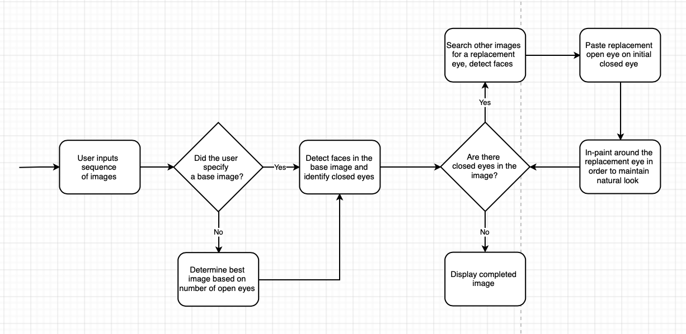

Code may be accessed on Github at [All-Eyes](https://github.com/elliotBraem/all-eyes).

## Results

Using an image with eyes closed as the base image (top left), our program locates an image witheyes open (bottom left), replaces the closed eyes in the base image with the open eyes (top right), then inpaints the replacement eyes to attempt a natural look (bottom right).
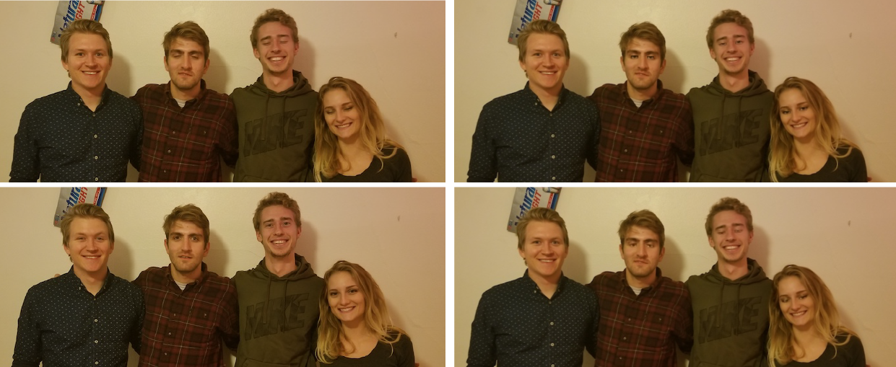
In some cases, the intial eye replacement looks more natural than the inpainting. This can be improved upon.
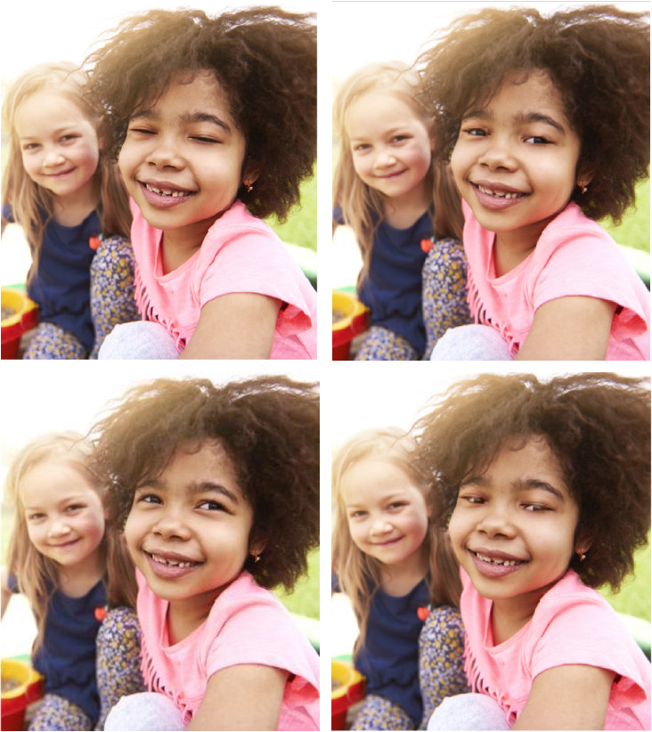

## The Team

**Elliot Braem** | **Connor Waity** | **Natalie Brooks** | **Austen Baker** |
------------ | ------------- | ------------ | -------------
  |  | 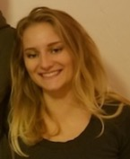  | 
*Computer Science, graduating 2019* | *Computer Science, graduating 2020* | *Computer Science, graduating 2019*  | *Computer Science, graduating 2020*
elliot@brae.me | cbwaity@wisc.edu | natalierose7465@gmail.com | austenbaker225@gmail.com

## Timeline

| Task | Time |
| :--- | ---: |
| Locate a face in an image | Early Oct |
| Locate the eyes on a face | Early Oct |
| Preliminary eye matching | Late Oct |
| Distinguish between closed and opened eyes | Early Nov |
| Identify the same set of eyes in the image sequence | Early Nov |
| Apply the replacement to the closed eyes | Mid Nov |
| In-Paint the replacement to match the image | Late Nov |

## State of the Art
#### **Facebook’s Eye In-Painting with Exemplar Generative Adversarial Networks**

Facebook’s Eye In-Painting technique utilizes in-painting as a backbone for a sophisticated system of machine learning that occurs through the interaction of two processes. In-painting is a process that synthesizes patches for holes in an image using the pixels around it. It can be used to help smooth out an image and make the different components of it consistent with one another. Facebook’s version of in-painting is an algorithm that breaks down the image into structural and textural components, which are then used to aid in constructing patches for holes that will be consistent with the rest of the image (in terms of lighting, color, contrast, etc.). Facebook replaces the closed eyes with open eyes from another image of the same person, then uses two processes to perform the in-painting. One process constructs the patches while another process checks how realistic the patches are by referencing a bank of pictures.

See references: [Facebook Eye In-Painting Paper](https://research.fb.com/wp-content/uploads/2018/06/Eye-In-Painting-with-Exemplar-Generative-Adversarial-Networks.pdf) and [Forbes Article on Facebook Eye In-Painting](https://www.forbes.com/sites/paulmonckton/2018/06/21/how-facebook-can-open-your-eyes/#65235a5a6d16).

#### **Adobe Photoshop’s “Open Closed Eyes” Feature**

Photoshop’s “Open Closed Eyes” element is a procedure that requires quite a few steps and is essentially a direct cut-and-paste method with in-painting. The user identifies a closed eye, then chooses a .png image (in this case, a cutout of eyes) to copy from where a person’s eyes are open. The open eyes then replace the closed eyes and Photoshop performs its own in-painting to make the result appear realistic. This method is relatively inflexible, in the sense that eyes taken from a picture that were not in the same lighting or from exactly the same angle may not look realistic or consistent with the structure/texture of the rest of the image after in-painting.

See references: [Essential Photoshop Elements: Open Closed Eyes Tutorial](https://www.essential-photoshop-elements.com/open-closed-eyes-with-Photoshop-Elements-2018.html) and [Digital Photography for Moms: Open Closed Eyes Tutorial](https://www.digitalphotographyformoms.com/open-closed-eyes-in-photoshop-elements-quick-tip/).

#### **Google’s “Image Cache for Replacing Portions of Images”**

Google’s approach is much like that of Photoshop’s, in that it uses a cut-and-paste method, where the closed eyes are overlaid with clipped open eyes taken from another picture. However; since Google’s method builds its image database automatically from all a person’s pictures, the database is much more comprehensive and can be searched through much more efficiently for an optimal clipping. Of course, the best optimization of this method relies on a person’s image database to be considerably large in order for there to be enough options, and at worst, it has the same results as Photoshop, but is faster and less complicated to use.

See references: [What a Future: Google Photos New Feature](http://www.whatafuture.com/google-photos-new-feature/) and [US Patent and Trademark Office: "Image Cache for Replacing Portions of Images](http://appft.uspto.gov/netacgi/nph-Parser?Sect1=PTO2&Sect2=HITOFF&u=%2Fnetahtml%2FPTO%2Fsearch-adv.html&r=16&p=1&f=G&l=50&d=PG01&S1=(20170413.PD.+AND+(Google.AS.+OR+Google.AANM.))&OS=PD/04/13/2017+AND+(AN/Google+OR+AANM/Google)&RS=(PD/20170413+AND+(AN/Google+OR+AANM/Google))).

## The Process
#### **Initial Face Detection**

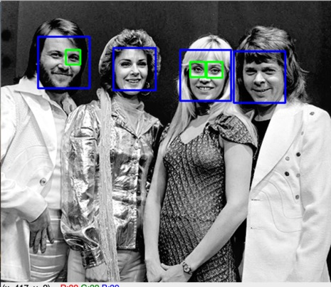

In order to get a feel for the project, we first implemented a preliminary face detection using Haar Cascade, as provided by Python OpenCV. Haar Cascade is based on the Viola-Jones Object Detection Algorithm, which is trained on a large set of positives and negatives, then uses certain features to determine if an object is detected. This algorithm is available through an openCV method, but one of the parameters, detectMuliScale, must be tuned in order to detect all objects in an image. Since detectMultiScale is dependent on the image, the same value does not always work from image-to-image. A more robust approach would be necessary.

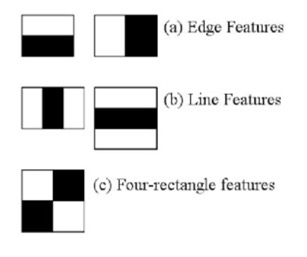

In most cases, Haar Cascade was able to detect all of the faces in a given image, however, false positives were also common. Moreover, because eyes are more abstract and less clear than faces, the Haar Cascade failed to detect them most of the time. Knowing that this project relies on identifying eyes in an image, this too required a more robust approach.

See tutorial for Haar Cascade as provided by Python OpenCV [here](https://docs.opencv.org/3.4/d7/d8b/tutorial_py_face_detection.html).

#### **Superior Facial Detection with dlib**

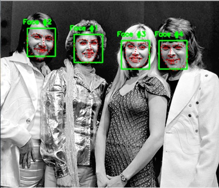

In order to improve detection accuracy, we converted to a Histogram of Oriented Gradients, or HOG, based face detection. This proved to be more robust in detecting faces and had less false-positives. This method uses shapes and gradients to detect a face rather than solely lighting, so it was more effective in our application. It also does not have to be tuned to the image, so it is also more universal which is important for an application of our scale.

Once the face is detected, we used a predictor to identify facial features. The predictor predicts where facial features may lay relative to their position on the face, then identifies the feature in this area. This is much more reliable than the Haar Cascade method since, for every face detected, two eyes are always detected as well. Unfortunately, a trade off is that this method is less effective on profiles, since half of the "predictable" face is visible.

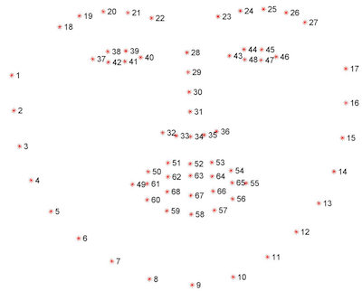

See tutorial for dlib's facial landmark detector [here](https://www.pyimagesearch.com/2017/04/03/facial-landmarks-dlib-opencv-python/).

#### **Open/Closed Eye Detection**

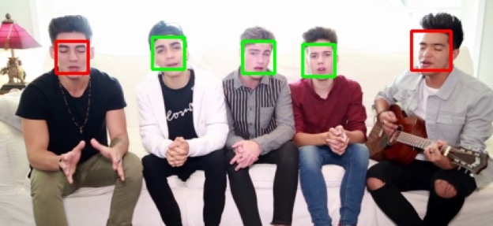

We went through several different methods when trying to determine if eyes were open or closed. First, we attempted using Hough Circles to try and recognize the shapes found in open eyes. This worked sometimes, but often wasn't able to find meaningful circles in eyes that were open. We also attempted using the colors within the region of the eye checking for varying amounts of white or other color pixels, this too worked somewhat inconsistently and was later reworked. We finally arrived on a solution that gave us the most consistent results, using the shape of the region of the eye to allow us to very consistently determine the state of the detected eye.

Given dlib's six point eye area, we are able to determine whether an eye is open or not based on the ratio of the top of the eye to the bottom. We ran many images through our detection and found a threshold ratio we decided to use when filtering results of eyes as open or closed. Relying on the regions described as holding the eye allowed us great results and performed well in a great variety of lightings and sub optimal angles.

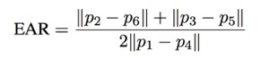

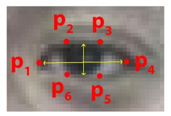

#### **Replacing the Eyes**

Several steps were necessary to allow us to achieve our end goal of finding and replacing closed eyes. After finding all the faces in the base image and determining the faces with closed eyes that needed to be swapped, all faces in the images in the source directory were also analyzed and stored in a matrix. We used the similarity of these images and the locations of the faces to determine suitable matches for closed and open eyes.

Once a match was found, we took the eyes from the open eye image, and placed them in a sensible position on the base image, we tried many approaches to make this look natural and produce consistent results, but we were ultimately only moderately successful with this. While we were able to consistently determine closed/open eyes and locate and match faces, placing and painting the eyes onto the new image proved to be a relatively difficult task where we had varying degrees of success.

We used several methods of actually placing the eyes on the new face, from just simply putting the pixels of the new eyes on the base image, to using blur, masking, and blending methods to achieve a more natrual look. There were some images where certain strategies worked better and more consistently, and others where they did not. All in all this was a learning process that could definitely be improved, and provided a great insight into the intricicies of making believable and seamless modifications to an image.

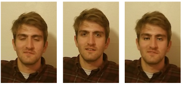

Using blur, a mask, a poisson blending, we achieved an example of a semi-convincing replacement.
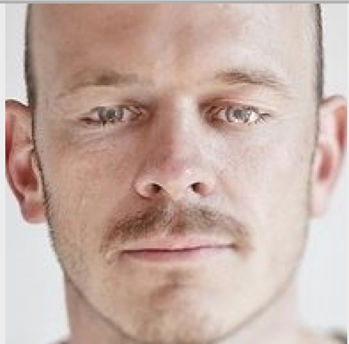

## Plans for Improvement
There are a lot of similar improvements to replacing eyes that can be done to photos. Smiles, and other facial features could be swapped on a face, using a similar method and given the same detection process we use. Because of how we chose to implement our solution, improving inpainting and matching could be used across a wide bredth of features, and the same functions we wrote could swap many different features, in different ways without too much modification.

Of course, there are always improvements to be made in trying to get the most cost effective *realistic* results, which relies a lot on the intricacies of in-painting. A worth while improvement to pursue would be a general and time-efficient fix to the uncanny results of some of the superimposed eyes. We believe that we could spend a lot more time, and iteratively improve our process in order to continually make improvements to the consistency and believability of our applications replacement painting.

Given more time we would have loved to implement a mesh face or triangulation of key points to allow us to even more accurately place eyes. This was attempted and worked on during our development but set aside for other features and not finished before the deadline. Doing this would improve our current applications eye placement, as well as allow us to use different source images when finding and replacing eyes. 
