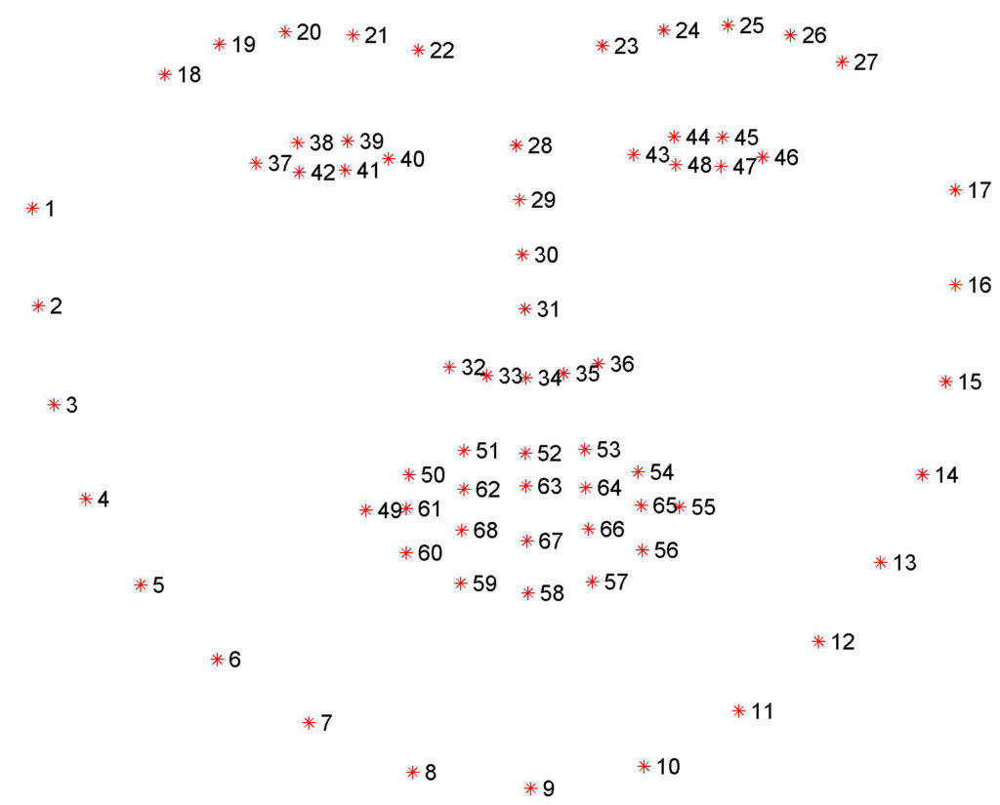

# all eyes
#### *A python application able to detect and replace closed eyes in an image*

## Contents
[Motivation](#motivation)

[State of the Art](#state-of-the-art)

[Project Flow](#project-flow)

[Implementation](#implementation)

[Results](#results)

[The Team](#the-team)

[The Process](#the-process)

[The Solution](#the-solution)

[Plans for Improvement](#plans-for-improvement)

## Motivation
In a photo, closed eyes can occur for a number of reasons, such as the blinding light of a camera’s flash, a mistimed blink, or some other unexpected event. A single individual with closed eyes greatly reduces the picture’s quality and worth, prompting a retake. However, retaking the picture doesn’t ensure that all eyes will be open; a retake is just as much at risk as the initial image. All-eyes attempts to solve this problem using face and closed eye detection, local images, and in-painting to achieve a natural, low cost replacement.

## State of the Art
...

## Project Flow

## Implementation
Code may be accessed on Github at [All-Eyes](https://github.com/elliotBraem/all-eyes)

## Results
Final product:

## The Team
**Elliot Braem**  
*Computer Science major, graduating 2019*  
email: braemelliot@gmail.com  

**Connor Waity**  
*Computer Science major, graduating ???*  
email: cbwaity@wisc.edu  

**Natalie Brooks**  
*Computer Science major, graduating 2019*  
email: natalierose7465@gmail.com  

**Austen Baker**  
*Computer Science major, graduating 2020*  
email: austenbaker225@gmail.com  

## The Process
#### **Initial Face Detection**

In order to get a feel for the project, we first implemented a preliminary face detection using Haar Cascade, as provided by Python OpenCV. Haar Cascade is based on the Viola-Jones Object Detection Algorithm, which is trained a large set of positives and negatives, then uses certain features to determine if an object is detected. The detectMuliScale parameter must be tuned in order to detect all objects in an image, but does not always work from image-to-image.

In most cases, Haar Cascade was able to detect all of the faces in a given image, however, false positives were also common. Moreover, because eyes are more abstract and less clear than faces, the Haar Cascade failed to detect them most of the time.

See tutorial for Haar Cascade as provided by Python OpenCV [here](https://docs.opencv.org/3.4/d7/d8b/tutorial_py_face_detection.html).

#### **Superior Facial Detection with dlib**

In order to improve accuracy, we converted to a HOG-Based face detection which proved to be more robust in detecting faces and had less false-positives. Once the face is detected, we use a predictor to identify facial features. It identifies facial features relative to their position on the face and is much more reliable since, for every face detected, two eyes are always detected as well.

See tutorial for dlib's facial landmark detector [here](https://www.pyimagesearch.com/2017/04/03/facial-landmarks-dlib-opencv-python/).

#### **Open/Closed Eye Detection**

Given dlib's six point eye area, we are able to determine whether an eye is open or not based on the ratio of the top of the eye to the bottom. Given formula and re ....... ????

TBC

## The Solution

## Plans for Improvement
There is a lot to be done along the lines of editing photos based on a photo bank. Specifically with group pictures, it is not uncommon for a member of the group to not be smiling, which could be superimposed then in-painted as well. 
